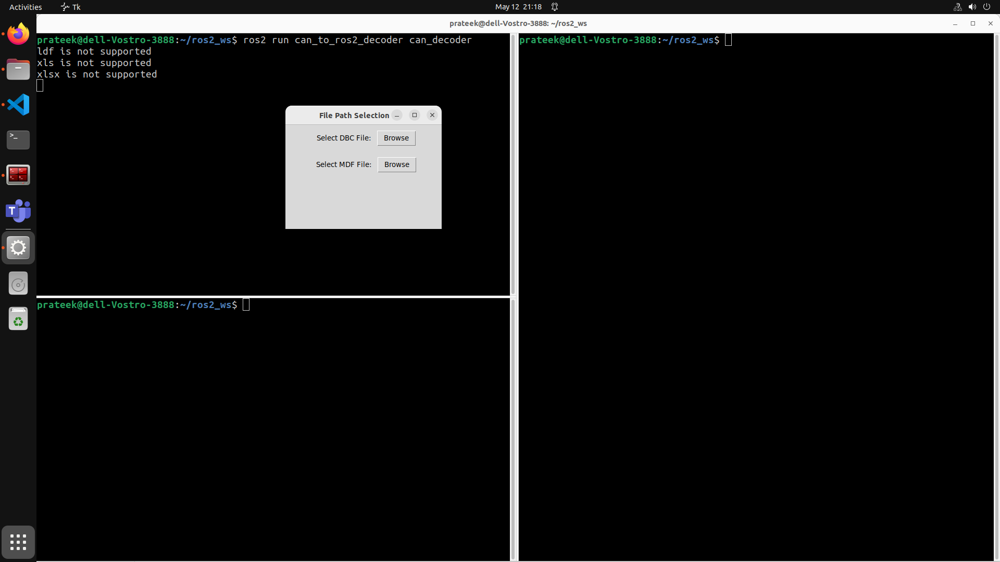
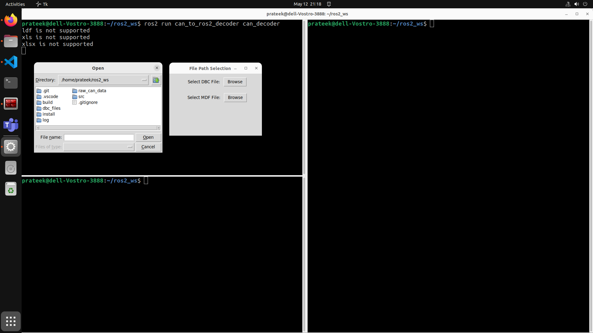
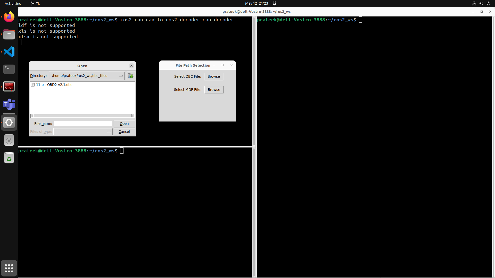
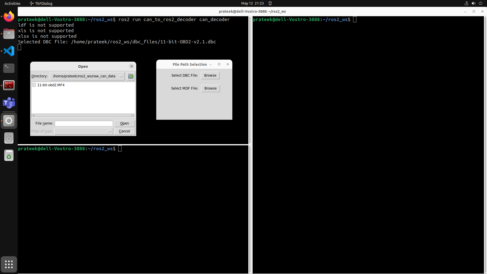
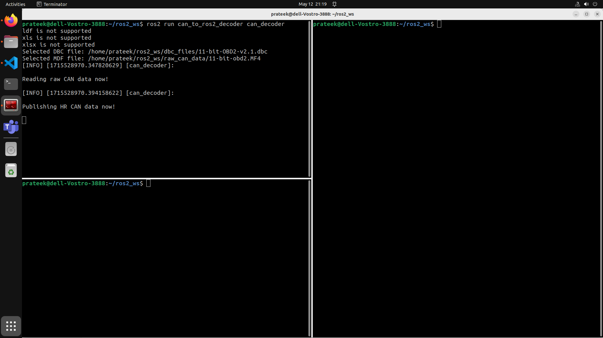
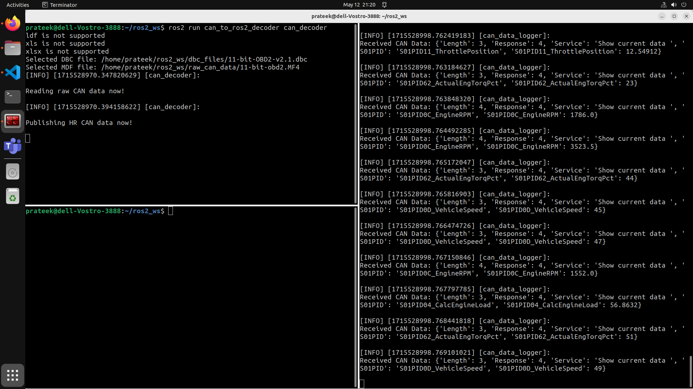
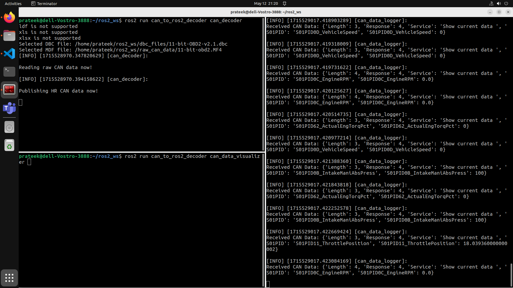
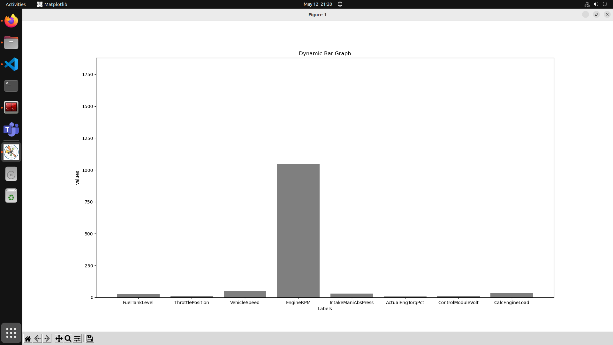
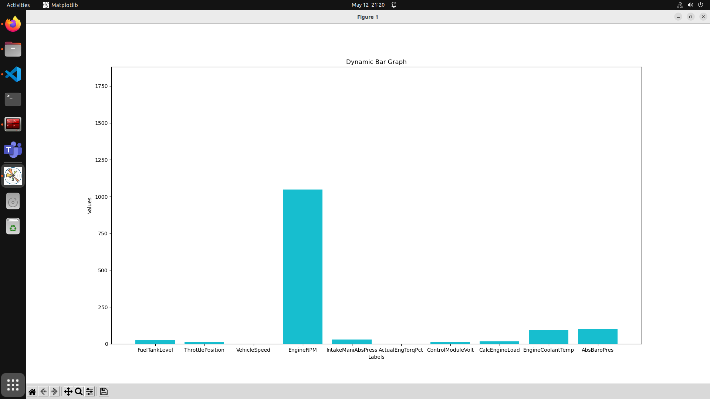

# CAN Bus to ROS2 Driver and Visualizer

## Introduction

The `Controller Area Network (CAN)` Bus is a de-facto standard for message-based communication between `Electronic Control Units (ECUs)` in automotive industry. `Robotic Operating System (ROS)` is an open-source framework that allows developers build robotic applications. The CAN Bus carries CAN Frame packets generated by various ECUs which are logged into its logger.  ROS, on the other hand, follows a pub-sub model, with nodes publishing data to some topic (`publishers`) to send data, and other nodes subscribing to that topic (`subscribers`) to receive data.  
This driver provide here allows CAN Bus logger's data (stored in `MF4` format) to connect with ROS2 nodes, followed up by a simple visualizer that helps the user visualize the received data, in real time.  

## Setup

1. Add the following lines in the configuration file for bash environment (`sudo gedit ~/.bashrc`) to prevent re-sourcing.

```sh
source /opt/ros/humble/setup.bash
source /usr/share/colcon_argcomplete/hook/colcon-argcomplete.bash
source ~/ros2_ws/src/install/setup.bash
source ~/ros2_ws/src/install/local_setup.bash
```

2. To start with the project, ensure you have ROS2 and python3 setup on your system. Then, simply clone the repo as:

```sh
git clone git@github.com:prateekbhaisora/CAN_to_ROS2_driver.git
```

3. Run the script provided along with the code to ensure that all the Python dependencies are set up on your system. To do that, execute the following commands:

```sh
sudo chmod +x requirements.sh
bash requirements.sh
```

4. Open a terminal and execute the following commands to start the decoder node:

```sh
colcon build --packages-select can_to_ros2_decoder
ros2 run can_to_ros2_decoder can_decoder 
```

5. Select your `DBC` and `raw CAN data` file, as prompted by the `Graphical User Interface (GUI)`.






6. Close this file selection window and your decoder node will start reading raw CAN data and publish Human Readable (HR) CAN data.



7. Open a new terminal and run the following commands:

```sh
ros2 run can_to_ros2_decoder can_data_logger
```

8. The logger node will automatically start receving data and publishing it to the relevant topic and also on the terminal.



9. Open a new terminal and run the following command:

```sh
ros2 run can_to_ros2_decoder can_data_visualizer 
```

10. This will start a CAN data visualizer, that dynamically changes as data is recieved, on your console.




